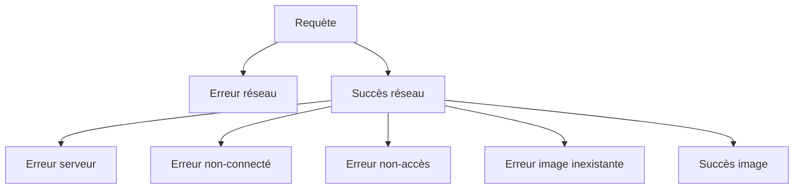

# Quitter le chemin du bonheur: toutes ces choses que nous appellons « erreur »

## Qui suis-je

- Juliette Lamarche
- Poétesse et bachelière es mathématiques devenue cuisinière devenue développeuse
- Dev Front-End (React et TypeScript) à la Banque Nationale du Canada via Go Rock IT.


## Résumé

- il m'est souvent arrivé d'essayer de faire de la gestion d'erreurs sans intention réelle
- vécue des discussions qui tournaient en rond, car notion faussement évidente

Je vais 3 notions distinctes d'erreurs.

## Erreurs inattendues (Unexpected Errors)


Une erreur inattendue survient lorsqu'on détecte un état dans lequel un programme ne devrait pas se retrouver. Une erreur inattendue doit être réparée en modifiant le programme.

Typiquement se présente comme une exception.

Le moteur JavaScript peu en émettre

- `f()` => `Uncaught TypeError: f is not a function`
- `x.a` => `Uncaught SyntaxError: Invalid or unexpected token`

## Instruction d'assertion (Code Assertion)

- une propriété qu'on pense être vrai
- commentaire vs assertion

```typescript
if (x > y) throw new Error('x should be greater than y')
```

- mieux maintenu
- langage standard
- plus grande confiance

En l'absence d'assertion :

- un état aberrant va éventuellement mener à un comportement imprévu
- bug intermittent, difficile à reproduire
- distance entre la cause et l'effet
- risque de sécurité

### Quoi faire avec une erreur inattendue

- planter l'application
- vs modifier le code pour corriger ou accepter la donnée abberrante
  - complexité peut se propager en amont
  - mettre des ressources sur quelque chose qui apporte peu de valeur et va causer pleins d'autres erreurs en aval
  - fail fast
- monitoring
- compartimenter (react error boundary), repartir la composante (erlang)

## Instruction d'assertion (typed edition)

- une assertion remplace avantageusement un type cast

```typescript
// z!
if (z == undefined) throw new Error('z should be defined')
// z as number
if (typeof z !== 'number') throw new Error('z should be a number')
```

Quand c'est possible, préférer une assertion à un cast

## Utilitaire

```typescript
export function isoAssertion(
	condition: boolean,
	message?: string,
): asserts condition {
	if (condition === false) throw new Error(message ?? 'assertion failed')
}

isoAssert(x > y, 'x should be greater than y')
```

## Pourquoi on a des erreurs inattendues

- le système de type a ses limites
  - TypeScript: la somme de deux nombres entiers est un nombre entier
- pas souhaitable de pousser le système de types à ses limites
  - coût
  - maintenabilité, lisibilité
- dans des systèmes très critiques, on utilise un assistant de preuve (Lean, Coq) pour prouver des propriétés du code (pas pour les mortels)

## Comment les éviter

- les assertions sont parfois le symptôme d'une mauvaise modélisation
- chercher un état impossible est une manière de trouver et communiquer les lacunes d'une modélisation

### Rendre irreprésentable les états impossibles

```typescript
{ loading: true: error: true }
{ status: 'loading' } // 'loading' | 'error' | 'succes'
```

```typescript
[
  { url: "/a", handler: handlerA },
  { url: "/b", handler: handlerB },
  { url: "/a", handler: handlerC },
];
{
  '/a': {
    handler: handlerA,
  }
  '/b': {
    handler: handlerB,
  }
}
```

Pas toujours possible:

- les requis évoluent et la refactorisation ne vaudrait pas l'effort
- données dénormalisées

```typescript
{
    a: {
        id: 'a',
        value: 'toto',
    },
    b: {
        id: 'b',
        value: 'kiki',
    }
}
```

## Erreurs concrètes que j'ai attrapé

- une fonction devait avoir la même référence à deux endroits, j'employais une dépendance ordinaire au lieu d'une peer dependency

## Erreurs attendues (Expected Errors)


Une erreur attendue est l'échec d'une condition nécessaire pour réaliser une opération. La condition est testée à même cette opération, et est présentée à la place du résultat de l'opération.

Considérons cette interface (fictive):

```typescript
const str = 'ajfskla;;fjklsd;afjkl;dsjfkl;sd'
const target = 'fk'

if (str.has(target)) {
	const index = str.findIndex(target)
	// ...
}
```

Cette interface serait:

- désagréable
- inefficace

Donc on préfère:

```typescript
const index = str.findIndex(target)
if (index >= 0) {
	// ...
}
```

- Représentation distincte des valeurs de succès et les valeurs d'erreur

### Étude de cas, identifier les requis potentiel d'une gestion d'erreur

En tant qu'utilisateur, je veux afficher une image d'un chat qui n'est accessible que si je suis connecté et que j'ai les droits d'accès.


- erreur de réseau
- erreur de serveur (500)
- je ne suis pas connecté (loggué)
- je n'ai pas les droits d'accès
- l'image n'existe pas

Comportements

- erreur réseau: relancer
- autre erreur: afficher un message significatif

Du point de vue de la requête réseau, une erreur comme l'absence d'image est un succès.

**Imbrication**: Représenter un succès qui contient une erreur ou un succès.



Côté serveur, on a une séquence d'actions qui s'interrompt au premier échec.

**Séquence**: On veut être capable de combiner une séquence d'opération avec un potentiel d'erreur sans avoir à gérer manuellement l'échec d'une erreur précédente à chaque fois.

**Information**: On veut garder une identité distincte pour chaque erreur, et possiblement lui associer d'autre information (par exemple la collection dont fait partie le gif auquel je n'ai pas accès)

**Exhaustivité**: On veut être capable de garantir par les types que toutes les sortes d'erreurs possibles sont gérées.

**Sérialisabilité**: On veut être capable d'envoyer l'erreur serveur au client sans transformation manuelle.

Ces requis ne sont pas toujours nécessaires.

## Différentes représentations des erreurs

### L'erreur comme une autre valeur

- valeur impossible: `findIndex`, -1
  - bonus: rend des états aberrant impossibles à représenter
  - courant en C ou Go (décrit directement la représentation en mémoire)
  - typage le plus simple
  - signification non-standard
- valeur spéciale: `undefined`, `null`, `NaN`
- instances de la classe erreur
  - distinguer les types d'erreur
  - ajouter de l'information qualitative
    - ex.: le nom du fichier manquant

- sérialisable: null
- non-sérialisable: la classe d'erreur et `undefined`
- imbrication (succès dans une erreur): aucune

Séquence: extraire dans une fonction auxiliaire

```typescript
function sequence(a) {
	const b = f1(a)
	if (b === undefined) return undefined
	const c = f2(b)
	if (c === undefined) return undefined
	return f3(c)
}
```

Control flow non-typés:

- exceptions
- valeur de rejet des promesses

Un objet de la classe erreur peut être passé comme une valeur.

## Result type (Either Modad)

```typescript
const s = {
    type: 'success'
    value: 3
}

const e = {
    type: 'error',
    message: 'not happy'
}
```

- très clair (le code est sa propre documentation)
- on peut **imbriquer** une erreur dans un succès

```typescript
const se = {
	type: 'success',
	value: {
		type: 'error',
		message: 'not happy, but deep',
	},
}
```

- types d'erreurs illimités, information arbitraire
- **sérialisable** (du moment qu'on ne construit pas l'objet avec une classe)

```typescript
function sequence(a) {
	const b = f1(a)
	if (b.type === 'error') return b
	const c = f2(b.value) // on doit déballer le succès
	if (c.type === 'error') return c
	return f3(c.value)
}
```

- type du résultat:
  - chaque type d'erreur, le type du succès
  - possible de garantir par le typage que toutes les erreurs ont été géré
- zod safeParse

```typescript
either(a).chain(f1).chain(f2).chain(f3)
```

## Erreur comme connotation

- couleur rouge
- icones :x: :poop:

- Lié au UX et au design
- Erreur technique vs métier
- Va souvent être lié à une erreur attendue ou une erreur inattendue dans le code, mais pas nécessairement.

## Give Feedback


