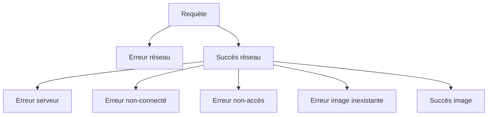

# Quitter le chemin du bonheur: toutes ces choses que nous appellons « erreur »

## Qui suis-je

- Juliette Lamarche
- Poétesse et bachelière es mathématiques devenue cuisinière deveneue développeuse
- Dev Front-End (React et TypeScript) à la Banque Nationale du Canada via Go Rock IT.


## Résumé

Je vais parler d'erreurs parce que c'est une notion qu'on inclue pas assez dans la conception logicielle à divers niveau, peut-être par absence d'une notion claire de ce qu'est une erreur.

Je vais 3 notions distinctes d'erreurs.

## Erreurs inattendues (Unexpected Errors)


Une erreure inattendue survient lorqu'on détecte un état dans lequel un programme ne devrait pas se retrouver. Une erreure inattendue doit être réparée en modifiant le programme.

Typiquement une expection.

Le moteur JavaScript peu en émettre - `Uncaught TypeError: f is not a function` - `Uncaught SyntaxError: Invalid or unexpected token`

## Instruction d'assertion (Code Assertion)

Quand on code, à un certain moment on a une propriété en tête qu'on pense être vraie, sur laquelle on compte pour la suite du programme. On pourrait en faire un commentaire. On en fait pluôt une assertion.

```typescript
if (x > y) throw new Error("x should be greater than y");
```

- mieux maintenu
- langage standard
- plus grande confiance

En l'absence d'assertion un état abhérent va éventuellement mener à un comportement imprévu

- intermittant, difficile à reproduire
- distance entre la cause et l'effet
- risque de sécurité

### Quoi faire avec une erreur inattendue

- monitoring
- planter l'application ou une partie de l'application (éventuellement la repartir)
- vs essayer de corriger l'erreur et poursuivre
  - mettre des ressources sur quelquechose qui apporte peu de valeur et va causer pleins d'autres erreurs en aval
- si il y a des efforts à mettre (ça dépend de l'application): compartimenter l'application en petites morceaux qui peuvent être redémarrés (cf. erlang, react: error boundaries)

## Instruction d'assertion (typed edition)

- une assertion remplace avantageusement un type cast

```typescript
// z!
if (z == undefined) throw new Error("z should be defined");
// z as number
if (typeof z !== "number") throw new Error("z should be a number");
```

Quand c'est possible, préférer une assertion à un cast

## Utilitaire

```typescript
export function isoAssertion(
  condition: boolean,
  message?: string,
): asserts condition {
  if (condition === false) throw new Error(message ?? "assertion failed");
}

isoAssert(x > y, "x should be greater than y");
```

## Pourquoi on a des erreurs inattendues

- le système de type a ses limites
  - typescript: nombres entiers
  - les branded types permettent d'annoter qu'un nombre est entiers, mais ne permettent pas de prouver que la somme de deux entiers est aussi un entier
- il n'est pas toujours souhaitable de pousser le système de types à ses limites
  - coût
  - maintenabilité, lisibilité
- dans des systèmes très critiques, on utilise un assistant de preuve (Lean, Coq) pour prouver des propriétées du code

## Comment les éviter

- les assertions sont parfois le symptôme d'une mauvaise modélisation
- chercher un état imposssible est une manière de trouver et communiquer les lacunes d'une modélisation

### Rendre irreprésentable les états impossibles

```typescript
{ loading: true: error: true }
{ status: 'loading' } // 'loading' | 'error' | 'succes'
```

```typescript
[
  { url: "/a", handler: handleA },
  { url: "/b", handler: handleB },
];
{
  '/a': {
    handler: handleA,
  }
  '/b': {
    handler: handleB,
  }
}
```

Pas toujours possibles:

- les requis évoluent et la refactorisation ne vaudrait pas l'effort
- données dénormalisées

```typescript
{
    a: {
        id: 'a'
        value: 'toto',
    },
    b: {
        id: 'b'
        value: 'kiki',
    }
}
```

## Erreurs concrètes que j'ai attrapé

- une fonction devait avoir la même référence à deux endroits, j'employais une dépendance ordinaire au lieu d'une peer dependancy

## Erreurs attendues (Expected Errors)


Une erreur attendue est l'échec d'une condition nécessaire pour réaliser une opération. La condition est testée à même cette opération, et est présentée à la place du résultat de l'opération.

Considérons cette interface (fictive):

```typescript
const str = "ajfskla;;fjklsd;afjkl;dsjfkl;sd";
const target = "fk";

if (str.has(target)) {
  const index = str.findIndex(target);
  // ...
}
```

Cette interface serait:

- désagréable
- inefficace

Donc on préfère:

```typescript
const index = str.findIndex(target);
if (index >= 0) {
  // ...
}
```

En conséquence, il est nécessaire de représenter d'une manière distincte les valeurs de succès et les valeurs d'erreur (sans risquer de les confondre).

### Étude de cas, identifier les requis potentiel d'une gestion d'erreur

En tant qu'utilisateur, je veux afficher une image d'un chat qui n'est accessible que si je suis connecté et que j'ai les droits d'accès.


- erreur de réseau
- erreur de serveur (500)
- je ne suis pas connecté
- je n'ai pas les droits d'accès
- l'image n'existe pas

S'il y a une erreur de réseau, je veux relancer la requête. S'il y a un autre type d'erreur, je veux afficher un message approprié.

**Imbrication**: on veut être capable de représenter de manière distincte:



Du point de vue de la requête html, toutes les erreurs autre que l'erreur réseau sont un succès.

Côté serveur, on a une séquence d'actions où chacune repose sur la précédente. On veut interrombre la séquence à la première erreur.

**Séquence**: On veut être capable de combiner une séquence d'opération avec une potentiel d'erreur sans avoir à gérer manuellement l'échec d'une erreur précédente à chaque fois.

**Information**: On veut garder une identité distincte pour chaque erreur, et possiblement lui associer d'autre information (par exemble la collection dont fait partie le gif auquel je n'ai pas accès)

**Exhaustivité**: On veut être capable de garantir par les types que tous les sortes d'erreurs possibles sont gérés.

**Sérialisabilité**: On veut être capable d'envoyer l'erreur serveur au client sans transformation manuelle.

Ces requis ne sont pas toujours nécessaires.

## Différentes représentations des erreurs

### L'erreur comme une valeur de plus

- valeur impossible: `findIndex`, -1
- valeur spéciale: `undefined` , `null`, `NaN`
- instances de la classe erreur

- les valeurs impossibles sont aussi une stratégie pour rendre les états contradictoires impossible à représenter
- non-sérialisable: la classe d'erreur et `undefined` ne sont pas sérialisables
- les instances de la classe d'erreur permettent de distinguer autant de types d'erreur que l'on veut et y ajouter de l'infromation arbitraire
- aucune de ces solution ne permet de représenter un succès qui contient une erreur

La manière la plus raisonnable de les combiner en séquence est simplement extraire une fonction.

```typescript
function sequence(a) {
  const b = f1(a);
  if (b === undefined) return undefined;
  const c = f2(b);
  if (c === undefined) return undefined;
  return f3(c);
}
```

Non typés:
    - exceptions
    - valeur de rejet des promesses

Un objet de classe erreur peut être passé comme une valeur.

## Result type (Either Modad)

```typescript
const s = {
    type: 'success'
    value: 3
}

const e = {
    type: 'error',
    message: 'not happy'
}
```

- très clair
- on peut **imbriquer** une erreur dans un succès
- les types gardent la trace des erreurs potentielles, peut porter de l'information arbitraire
- **sérialisable** ou non (selon l'implémentation)

```typescript
function sequence(a) {
  const b = f1(a);
  if (b.type === "error") return b;
  const c = f2(b.value); // on doit déballer le succès
  if (c.type === "error") return c;
  return f3(c.value);
}
```

- zod safeParse

## Erreur comme connotation

- couleur rouge
- icones

Plutôt lié au UX et au design. Va souvent être lié à une erreur attendue ou une erreur inattendue dans le code, mais pas nécessairement.

## Give Feedback


